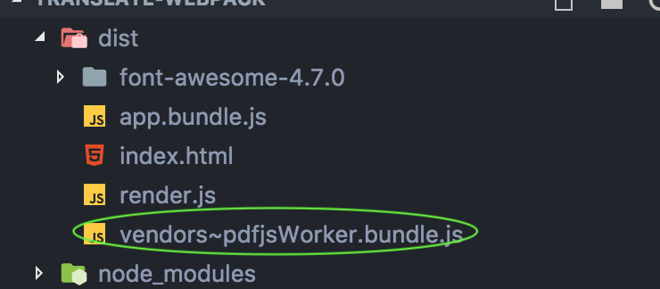

## 问题记录：

### 1. React 里面不能引入 Electron 的 API （比如 ipcRenderer），因为 React 是web浏览器环境，既不是Node环境 ，也不是 Electron 的渲染进程，所以也就不能调用require 来引入Electron。

>🦑 解决：为了在浏览器环境中能够引入 Electron 的 API，可以如下配置：在 Electron 主进程 main.js 中的 webPreferences 里配置预加载脚本 render.js，此脚本里面将 electron 模块作为 浏览器 global 对象的属性，参考链接：[React组件中如下使用electron](https://www.cnblogs.com/lfqcode/p/9534754.html) ，但是实践证明此连接中有一步是多余的，即在 index.html 中`require('./render,js')`这一步可以不用:

```js
// render.js;

global.electron = require('electron')

```
```js
// main.js:

preload: path.join(__dirname,'./dist/render.js' ) 
                // './dist/electronRender.bundle.js'

/*
                preload String (可选) 
                -在页面运行其他脚本之前预先加载指定的脚本 无论页面是否集成 Node, 
                此脚本都可以访问所有Node API 脚本路径为文件的绝对路径。 
                */
```
```js
//index.html:

```
因为在 Electron 预加在的脚本可以引入 Node API，也就可以引入 Electron 模块，现在在React组件中可以如下使用electron
```js
// App.js:
const electron = window.electron;
const {ipcRenderer} = electron;
```
>🦔 其他解决办法：

在 webpack.config.js 配置中，把要使用 electron API 的入口文件的打包目标设置为 electron-renderer，将其编译为 Electron 渲染进程，这样就可以在这个进程中引入  electron API。
[在Webpack中如何构建Electron应用](http://www.php.cn/js-tutorial-403905.html)此链接是可以的，
但是对于本项目的情况，
有如下报错，不知道为什么：

>Uncaught ReferenceError: require is not defined
 
### 2. webpack 打包太慢
因为我在 Electron 主进程引入了 `const pdf = require('pdf-parse');`,那么 webpack 就会打包出来一个 `vendors~pdfjsWorker.bundle.js` 出来:


